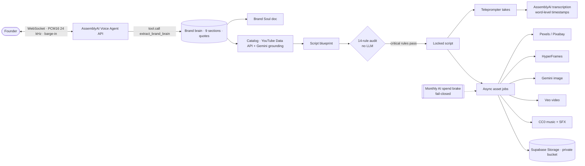

# Brand Studio Agent

**A voice-first studio that takes a founder from "who am I?" to a shootable, fact-checked short video — and refuses to hand over a script that breaks its own rules.**

Built for the [AssemblyAI Voice Agent Hackathon](https://lablab.ai/ai-hackathons/assemblyai-voice-agent-hackathon) (September 2026) by **VibeMarketing Studio**.

- **Live demo:** https://brand.singularityos-ai.com
- **Judges:** a judge account with a fixed credit allowance is shared privately through the lablab support ticket, never in this public repo (every AI asset costs real money).
- **What changed and when:** [CHANGELOG.md](CHANGELOG.md)

---

## The problem

Editing tools are solved. They cut silences, add captions and publish everywhere. None of them tells you an idea is weak.

For someone building a personal brand without a content background, the bottleneck was never editing speed. It was judgment: knowing who you are on camera, which idea is worth recording, and why the one you love will not land.

## How it works — five steps, one rail

The screen shows a pipeline rail. Each step unlocks the next; a step you have not finished shows a lock and a button back to what is pending.

### 1. Brand Soul — a voice interview, not a form
You talk to **Brandy**, a voice agent on the **AssemblyAI Voice Agent API** (WebSocket, PCM16 24 kHz, barge-in, JSON-schema tool calling). As you talk, Brandy calls `extract_brand_brain` and fills a **9-section brand brain** (diagnosis, brand journey, audience, contrarian stance, identity, offer, lead magnet…). Every section keeps the **quote of what you actually said** that justifies it. The full Brand Soul document is generated from that brain.

### 2. Catalog — ideas with demand evidence
A research pass (YouTube Data API + Gemini with search grounding) collects demand signals for your niche and proposes **30 video ideas across 5 master categories**, each tied to a concrete signal. You accept, discard, regenerate or add your own, then lock the catalog.

### 3. Scripting — a blueprint that has to pass an audit
Each locked idea becomes a 6-phase script (hook → lock-in → point 1 → rehook → point 2 → CTA) with, per scene: spoken text, shot, on-screen text, acting note, sound, and a proposed visual type with its stock query or visual prompt.

Every script is audited by **14 deterministic rules (no LLM)**. The **9 critical ones must pass before the script can be locked**:

| Critical (block locking) | Informational |
|---|---|
| Duration 45–90 s (estimated) | Hook acting note is concrete |
| All 6 phases present | Rehook before the second point |
| Exactly 2 key points | On-screen text ≤ 8 words |
| Frame zero says why it stops the scroll | Max one rhetorical question and one list of three |
| No "it's not X, it's Y" pattern | No AI-blacklist words |
| No AI counter-examples | |
| Every number has a source | |
| Has a call to action | |
| Single language (all scenes use 1 language) | |

You can iterate a single scene with an intent ("make it punchier") and the audit re-runs. It does **not** predict views — nobody can. It checks structure against rules anyone can read.

### 4. Audiovisual — record, then generate only what the camera can't show
- **Record every scene** with a built-in teleprompter; retakes are free. Each take is transcribed by **AssemblyAI** (pre-recorded API) with **word-level timestamps** — the raw material for real subtitles.
- **B-roll per scene:** the script proposes a type, **the founder decides**, seeing the price before spending anything:

| Type | Source | Credits |
|---|---|---|
| Camera (you) | your take | free |
| Stock | Pexels / Pixabay, with attribution | free |
| Motion graphic | HyperFrames templates | free |
| AI image | `gemini-3.1-flash-lite-image` (Vertex AI) | 15 |
| AI video (≤ 1 per script) | `veo-3.1-lite-generate-001` (Vertex AI) | 150 |

  When you switch a scene to a type that needs a prompt it doesn't have, a text model writes one (async, 8 s timeout, deterministic fallback).
- **Soundtrack and SFX:** an AI audio director picks mood and energy; the track comes from a local **CC0 library** (14 tracks, 15 effects, Freesound — credits in `app/audiovisual/library/*.json`). Listen-only here; mixing happens in Editing.
- **Generation runs as resumable background jobs** with a live progress bar. Charges happen only when an asset succeeds, written ahead so a retry can never charge twice.

### 5. Editing — not built yet
See [What's missing](#whats-missing).

---

## Architecture



**Where AssemblyAI sits:** the whole voice conversation (Voice Agent API) and the transcription of every recorded take (word-level timestamps). Gemini/Veo cover images, video and research — things AssemblyAI does not offer.

Original design document (includes pieces that were planned and not built): [docs/ARCHITECTURE.md](docs/ARCHITECTURE.md).

---

## Money safety

Real AI calls cost real money, so the app is built to fail closed:

- **Monthly AI spend brake** (`AV_MONTHLY_AI_SPEND_CAP_USD`, default $20): pending, running and finished AI jobs count against it. It is checked in the estimate, when generating, when regenerating, when switching a scene to AI, and last in the worker right before any paid call. If the check itself fails, AI is treated as paused.
- **Per-video ceiling** of $1.50 in real cost and **max 1 AI video per script**.
- **Credits are charged only on success**, with a write-ahead flag so retries and restarts never double-charge; a double click on *Generate* is rejected while a scene is in flight.
- Stripe price IDs come from environment variables, so a live key can never be paired with a test price.

---

## Status

| Piece | State |
|---|---|
| Voice interview with barge-in and tool calling (Brand Soul) | ✅ In production |
| 9-section brand brain with quotes · Brand Soul document | ✅ In production |
| Demand research + 30-idea catalog | ✅ In production |
| Script blueprint + 14-rule audit + lock | ✅ In production |
| Teleprompter recording + AssemblyAI transcription per take | ✅ In production |
| Stock / motion graphic / AI image / AI video B-roll, founder-chosen | ✅ In production |
| AI-chosen soundtrack + SFX from a CC0 library (listen-only) | ✅ In production |
| Credits, Stripe checkout, spend brake | ✅ In production (Stripe in test mode until launch) |
| **Editing** (assembly, silence cuts, dynamic subtitles, final MP4) | 📋 Next |
| Voice control of the whole pipeline (Brandy beyond the interview) | 📋 Planned |
| Raw footage upload | 📋 Coming soon (the API rejects it before charging) |

## What's missing

Being explicit, because a judge will open the code:

- **No final video yet.** Audiovisual prepares takes, B-roll, music and SFX; Editing (assembling them into an MP4 with dynamic subtitles) is the next block.
- **Voice drives the Brand Soul interview only.** Catalog, scripting and audiovisual are operated on screen today.
- **Raw footage upload** is not available; the selector says "coming soon" and the backend returns 400 before charging.
- The music and SFX library was selected by metadata (tags, rating, duration); a human listening pass is in progress.

---

## Setup

**Requirements:** Python 3.12+, Chrome or Edge (Safari ignores the `AudioContext` sample rate).

```bash
git clone https://github.com/SingularityOS-AI/brand-studio-agent.git
cd brand-studio-agent
pip install -r requirements.txt
cp .env.example .env        # then fill in your own keys
uvicorn app.main:app --host 0.0.0.0 --port 8000
```

### Environment variables

| Variable | Purpose |
|---|---|
| `ASSEMBLYAI_API_KEY` | Voice Agent API and take transcription |
| `SUPABASE_URL`, `SUPABASE_KEY`, `SUPABASE_PUBLISHABLE_KEY`, `SUPABASE_JWT_SECRET` | Auth, database and private storage |
| `VERTEX_AI_PROJECT_ID`, `VERTEX_AI_LOCATION` | Gemini (text, image) and Veo (video) on Vertex AI |
| `YOUTUBE_API_KEY` | Demand research for the catalog |
| `PEXELS_API_KEY`, `PIXABAY_API_KEY` | Stock B-roll |
| `STRIPE_SECRET_KEY`, `STRIPE_WEBHOOK_SECRET` | Credit purchases |
| `STRIPE_PRICE_STARTER`, `STRIPE_PRICE_PRO`, `STRIPE_PRICE_STUDIO` | Live price IDs (required with a live key) |
| `AV_MONTHLY_AI_SPEND_CAP_USD` | Monthly AI spend brake (default 20) |
| `AV_IMAGE_MODEL`, `AV_VIDEO_MODEL`, `AV_STORAGE_BUCKET` | Optional overrides |

**Never commit `.env`.** It is gitignored.

### Tests

```bash
python -m pytest -q -m "not e2e"
```

~600 tests. A network lock blocks every outbound connection (sync and async) during tests, and the test config never loads the real `.env`.

## Notes for anyone reading the code

- Audio is **PCM16 mono at 24 kHz, base64**. Force it with `new AudioContext({ sampleRate: 24000 })`.
- Do not send `input.audio` before `session.ready`. On barge-in, flush playback on `input.speech.started`, not on `reply.done`.
- The AssemblyAI key never reaches the browser: the server mints a short-lived token and the client passes it on the WebSocket URL.

## Deployment

Render (auto-deploy on push to `main`) via [`render.yaml`](render.yaml). Stripe webhook: `https://brand-studio-agent.onrender.com/api/stripe/webhook`.

## License

MIT — see [LICENSE](LICENSE).
