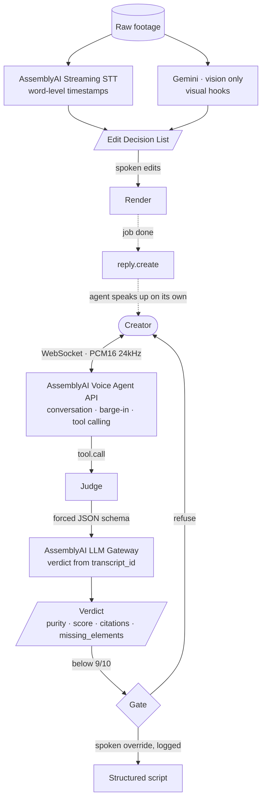

# Brand Studio Agent

**A voice agent that judges your content idea before you waste an evening recording it.**

Built for the [AssemblyAI Voice Agent Hackathon](https://lablab.ai/ai-hackathons/assemblyai-voice-agent-hackathon) (September 2026) by **VibeMarketing Studio**.

---

## The problem

Editing tools are solved. They cut silences, add captions, and publish everywhere. None of them ever tells you an idea is weak.

For someone building a personal brand without a content background, the bottleneck was never editing speed. It was judgment — knowing which idea is worth recording, and why the one you love will not land.

## What it does

You speak an idea, or you upload ten minutes of unscripted rambling.

The agent audits it against a written rubric and returns a verdict:

- **Is there a villain, or just a topic?** Without a common enemy or an unjust system, the piece is weak.
- **Does the subject land in the first five seconds?**
- **Is there a counterintuitive claim, or only consensus?**
- **Does it read like a machine wrote it?**
- **Is there a call to action?**

**Every score must quote the exact sentence that justifies it. No citation, no score.**

Below 9/10 the agent withholds the script. You can override it out loud, and the override is logged.

Then you argue. You interrupt it mid-sentence to defend your idea, it answers, you sharpen the line, the score moves. That loop is the product.

### What it measures

**Purity (0–99%)** — adherence to the protocol. A process metric.

It does **not** predict views. Nobody can: published work shows that even models trained on 500 hours of fMRI recordings fail to forecast YouTube replay behaviour (r = +0.058, p = 0.23). Auditing structure against a public rubric is a claim that survives scrutiny; predicting virality is not.

---

## Architecture

Full technical write-up: [docs/ARCHITECTURE.md](docs/ARCHITECTURE.md)




**AssemblyAI carries three of the four legs.** Gemini covers only vision, which AssemblyAI does not offer.

The dotted path matters: a tool returns in under a second, the render runs in the background, and the backend later pushes `reply.create` so the agent tells you it is done — **without freezing the conversation**.

---

## Status

This repository is the **foundation**, not the finished product. Being explicit about it:

| Piece | State |
|---|---|
| Secure token minting (`GET /api/token`) | ✅ Working |
| Browser client — WebAudio 24 kHz, AudioWorklet, hardware AEC | ✅ Working |
| Voice conversation with barge-in | ✅ Working |
| Tool calling (`tool.call` / `tool.result`) | 🔨 In progress |
| Async bus (`reply.create`) | 🔨 In progress |
| The Judge and the rubric | 🔨 In progress |
| Word-level STT → edit decision list | 📋 Planned |
| Render | 📋 Planned |

---

## Setup

**Requirements:** Python 3.12+ and an [AssemblyAI API key](https://www.assemblyai.com/dashboard/signup).

```bash
git clone https://github.com/SingularityOS-AI/brand-studio-agent.git
cd brand-studio-agent
pip install -r requirements.txt
cp .env.example .env      # then put your key in .env
python agent_mockup/server.py
```

Open `http://localhost:8088` in **Chrome or Edge**. Safari ignores the `AudioContext` sample rate and needs manual resampling.

### Environment variables

| Variable | Required | Purpose |
|---|---|---|
| `ASSEMBLYAI_API_KEY` | Yes | Voice Agent API, Streaming STT and LLM Gateway |
| `GEMINI_API_KEY` | For vision | Visual hook detection in raw footage |
| `HOST` / `PORT` | No | Defaults to `0.0.0.0:8088` |

**Never commit `.env`.** It is gitignored, and so is every internal document in this workspace.

---

## Stack

Python 3.12 · FastAPI · WebAudio API (PCM16 mono 24 kHz, hardware AEC) · AssemblyAI Voice Agent API (Universal-3 Pro, JSON-Schema tool calling, barge-in, `reply.create`) · AssemblyAI Streaming Speech-to-Text · AssemblyAI LLM Gateway · Google Gemini (vision) · FFmpeg

---

## Notes for anyone reading the code

- Audio is **PCM16 mono at 24 kHz, base64**. Force it with `new AudioContext({ sampleRate: 24000 })` so nothing resamples.
- Do not send `input.audio` before `session.ready`.
- On barge-in, flush the playback buffer immediately — on `input.speech.started`, not on `reply.done`. It feels roughly 300 ms snappier.
- The API key never reaches the browser. The server mints a short-lived token and the client passes it as `?token=` on the WebSocket URL.

---

## License

MIT — see [LICENSE](LICENSE).
