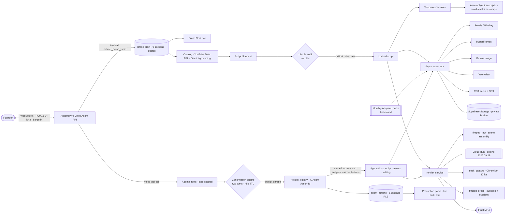

# Brand Studio Agent

**A voice companion that walks a B2B founder from "who am I on camera?" to a finished, captioned video built to sell — and refuses to hand over a script that breaks its own rules.**

Built for the [AssemblyAI Voice Agent Hackathon](https://lablab.ai/ai-hackathons/assemblyai-voice-agent-hackathon) (September 2026) by **VibeMarketing Studio**.

- **Live demo:** https://brand-studio-agent.onrender.com
- **How a judge tries it:** open the demo, sign in with Google and you start with **500 free credits**. Follow the rail from Brand Soul to Editing; every price is shown before anything is charged. (Every AI asset costs real money, so the allowance is fixed.)
- **How it is built:** [docs/ARCHITECTURE.md](docs/ARCHITECTURE.md)
- **What changed and when:** [CHANGELOG.md](CHANGELOG.md)

---

## The problem

Editing tools are solved. They cut silences, add captions and publish everywhere. None of them tells you an idea is weak before you spend the evening recording it.

For a founder building a personal brand, the bottleneck was never editing speed. It is **judgment**: knowing who you are on camera, which idea is worth recording, and why the one you love will not land. Faster execution of a weak idea only scales the failure, and nothing automated wins if you have no judgment.

Brand Studio Agent brings that judgment by voice, then gets the friction out of the way. A voice agent, **Brandy**, interviews you, researches ideas with real search data, audits your script against rules anyone can read, and — in **Agentic Mode** — operates the app with you, iterating by voice and confirming every paid action out loud. The result is a real personal brand: the founder's biggest asset for their business.

## What ships

| Block | What the founder gets | Built on |
|---|---|---|
| Brand Soul | Voice interview that fills a 9-section brand brain, each section backed by a quote; the Brand Soul document can be downloaded | AssemblyAI Voice Agent API |
| Catalog | 30 video ideas in 5 categories, each tied to a demand signal | YouTube Data API, Gemini search grounding |
| Script | 6-phase script with a 14-rule deterministic audit; 9 rules must pass to lock | Rules engine, no LLM |
| Audiovisual | Teleprompter takes, word-level subtitles, B-roll per scene chosen by the founder | AssemblyAI transcription, Pexels/Pixabay, Vertex AI |
| Editing | 1 Cut · 2 Auto-edit · 3 Export, rendered to MP4 by an FFmpeg service | Render service on Cloud Run, engine `2026.09.29` |
| Agentic Mode | Voice tools for the app's actions, two-turn explicit confirmation, audit trail | Action registry, `agent_actions` table |

## How it works — five steps, one rail

The screen shows a pipeline rail. Each step unlocks the next; a step you have not finished shows a lock and a button back to what is pending.

### 1. Brand Soul — a voice interview, not a form
You talk to **Brandy**, a voice agent on the **AssemblyAI Voice Agent API** (WebSocket, PCM16 24 kHz, barge-in, JSON-schema tool calling). As you talk, Brandy calls `extract_brand_brain` and fills a **9-section brand brain** (diagnosis, brand journey, audience, contrarian stance, identity, offer, lead magnet…). Every section keeps the **quote of what you actually said** that justifies it. The full Brand Soul document is generated from that brain and can be downloaded.

### 2. Catalog — ideas with demand evidence
A research pass (YouTube Data API + Gemini with search grounding) collects demand signals for your niche and proposes **30 video ideas across 5 master categories**, each tied to a concrete signal. You accept, discard, regenerate or add your own, then lock the catalog.

### 3. Script — a blueprint that has to pass an audit
Each locked idea becomes a 6-phase script (hook → lock-in → point 1 → rehook → point 2 → CTA) with, per scene: spoken text, shot, on-screen text, acting note, sound, and a proposed visual type with its stock query or visual prompt. You confirm the funnel stage (top, middle or bottom of funnel) and the recording format (for example teleprompter) — Brandy proposes, you confirm.

Every script is audited by **14 deterministic rules (no LLM)**. The **9 critical ones must pass before the script can be locked**:

| Critical (block locking) | Informational |
|---|---|
| Duration 45–90 s (estimated) | Hook acting note is concrete |
| All 6 phases present | Rehook before the second point |
| Exactly 2 key points | On-screen text ≤ 8 words |
| Frame zero says why it stops the scroll | Max one rhetorical question and one list of three |
| No "it's not X, it's Y" pattern | No AI-blacklist words |
| No AI counter-examples | |
| Every number has a source | |
| Has a call to action | |
| Single language (all scenes use 1 language) | |

You can iterate a single scene with an intent ("make it punchier") — by button or by voice — and the audit re-runs. It does **not** predict views; nobody can. It checks structure against rules anyone can read.

### 4. Audiovisual — record, then generate only what the camera can't show
- **Record every scene** with a built-in teleprompter; retakes are free. Each take is transcribed by **AssemblyAI** (pre-recorded API) with **word-level timestamps** — the raw material for real subtitles.
- **B-roll per scene:** the script proposes a type, **the founder decides**, seeing the price before spending anything:

| Type | Source | Credits |
|---|---|---|
| Camera (you) | your take | free |
| Stock | Pexels / Pixabay, with attribution | free |
| Motion graphic | HyperFrames templates | free |
| AI image | `gemini-3.1-flash-lite-image` (Vertex AI) | 15 |
| AI video (≤ 1 per script) | `veo-3.1-lite-generate-001` (Vertex AI) | 150 |

  When you switch a scene to a type that needs a prompt it doesn't have, a text model writes one (async, 8 s timeout, deterministic fallback).
- **Soundtrack and SFX:** an AI audio director picks mood and energy; the track comes from a local **CC0 library** (14 tracks, 15 effects, Freesound — credits in `app/audiovisual/library/*.json`). Listen-only here; mixing happens in Editing.
- **Generation runs as resumable background jobs** with a live progress bar. Charges happen only when an asset succeeds, written ahead so a retry can never charge twice.

### 5. Editing — 1 Cut · 2 Auto-edit · 3 Export
The pipeline assembles takes and B-roll into a finished MP4 through the render service (`render_service/`, FFmpeg + Chromium, deployed on Cloud Run). You start from the raw cut and refine it — by button or by voice — until you are happy:

- **1 Cut:** raw cut built scene by scene (`ffmpeg_raw.py`); motion-graphic HTML scenes rendered to MP4 via Chromium seek-capture at 30 fps (`seek_capture.py`, `motion.py`).
- **2 Auto-edit:** silence and filler trimming, one caption style per script, Clean / Standard / Bold looks, overlay controls, a draggable caption band, an animated overlay library (8 templates), and collision-free overlay layout.
- **3 Export:** subtitles and overlays burned in by `ffmpeg_dress.py`; the browser preview and the MP4 both draw what the RenderIR says, with the same numbers.
- **Empty-scene guard:** a motion graphic that renders blank falls back to the founder's face take or a declared AI image, and the render response lists the fallback so the UI can warn.
- **Pricing:** first render of an idea 20 credits, later renders 5, free when only the engine version changed.

Publishing is deliberately manual: you download the MP4 and post it yourself.

### Agentic Mode — Brandy operates the app with you
Agentic Mode is a toggle in the brand bar. Brandy's tools are scoped to the current step and call the same frontend functions and backend endpoints as the buttons — there is no parallel backend.

- **Tools:** script (generate, review, iterate, lock), catalog and Brand Soul, audiovisual (regenerate assets, B-roll) and editing (auto-edit, captions, overlays, music, render, share link), plus proactive announcements when a job finishes.
- **Two-turn confirmation:** before any irreversible or paid action Brandy states what will happen and its price, then waits for an explicit phrase (`"confirm"`, `"yes do it"`, `"do it"`, `"go ahead"`, `"proceed"`). `"yes"` alone is not accepted, and a pending confirmation expires after **45 seconds** (`app/static/confirm_engine.js`). The code checks the phrase, not the model.
- **Audit trail:** every agentic call carries `X-Agent-Action-Id` and is logged to `agent_actions` (Supabase, RLS on, service-role access only; migration `014_agent_actions.sql`). The production panel shows it live as a card queue with status, step, credit cost and a link to the asset.

---

## Architecture

The full description is in [docs/ARCHITECTURE.md](docs/ARCHITECTURE.md). The short version:


```mermaid
flowchart LR
    U([Founder]) <-->|WebSocket · PCM16 24 kHz · barge-in| VA[AssemblyAI Voice Agent API]
    VA -->|tool.call extract_brand_brain| BB[(Brand brain · 9 sections · quotes)]
    BB --> SOUL[Brand Soul doc]
    BB --> CAT[Catalog · YouTube Data API + Gemini grounding]
    CAT --> SCR[Script blueprint]
    SCR --> AUD{14-rule audit<br/>no LLM}
    AUD -->|critical rules pass| LOCK[Locked script]
    LOCK --> REC[Teleprompter takes] --> STT[AssemblyAI transcription<br/>word-level timestamps]
    LOCK --> JOBS[Async asset jobs]
    JOBS --> STK[Pexels / Pixabay]
    JOBS --> MG[HyperFrames]
    JOBS --> IMG[Gemini image]
    JOBS --> VEO[Veo video]
    JOBS --> MUS[CC0 music + SFX]
    GUARD[[Monthly AI spend brake<br/>fail-closed]] -.-> JOBS
    JOBS --> ST[(Supabase Storage · private bucket)]
    LOCK --> RS[render_service]
    RS --> RAW[ffmpeg_raw · scene assembly]
    RS --- CR[[Cloud Run · engine 2026.09.29]]
    RS --> CAP[seek_capture · Chromium 30 fps]
    RS --> DRESS[ffmpeg_dress · subtitles + overlays]
    RS --> MP4([Final MP4])
    VA -->|voice tool call| TOOLS[Agentic tools · step-scoped]
    TOOLS --> CONF{Confirmation engine<br/>two turns · 45s TTL}
    CONF -->|explicit phrase| ACT[Action Registry · X-Agent-Action-Id]
    ACT -->|same functions and endpoints as the buttons| APP[App actions: script · assets · editing]
    APP --> JOBS
    APP --> RS
    ACT --> DB[(agent_actions · Supabase RLS)]
    DB --> PP[Production panel · live audit trail]
```

**Where AssemblyAI sits:** the whole voice conversation (Voice Agent API) and the transcription of every recorded take (word-level timestamps). Gemini/Veo cover images, video and research — things AssemblyAI does not offer.

**Where it runs:** the web app on Render.com, data and files on Supabase, generation on Vertex AI, and the video render as a separate service on Google Cloud Run.

## Repository layout

| Path | What it is |
|---|---|
| `app/` | FastAPI backend and the static frontend (`app/static/`) |
| `app/agent/` | Agentic audit trail (`agent_actions`) |
| `app/audiovisual/` | Asset jobs, stock, AI generation, spend guard, music and SFX library |
| `app/catalog/`, `app/scripting/`, `app/tools/` | Catalog research, script audit, Brand Soul and brand brain |
| `app/editing/` | RenderIR, dressing, timeline and the render dispatch |
| `render_service/` | Independent FastAPI service: FFmpeg + Chromium render (own `Dockerfile`) |
| `supabase/` | Migrations (001–014) and schema |
| `tests/` | Test suite (no network, no real keys) |
| `scripts/` | Small ops helpers: `smoke_vertex_models.py` checks Vertex model access, `render_contact_sheet.py` builds contact sheets from a rendered MP4 |
| `docs/` | Architecture, build specs and their test evidence |

---

## Money safety

Real AI calls cost real money, so the app is built to fail closed:

- **Monthly AI spend brake** (`AV_MONTHLY_AI_SPEND_CAP_USD`, default $20): pending, running and finished AI jobs count against it. It is checked in the estimate, when generating, when regenerating, when switching a scene to AI, and last in the worker right before any paid call. If the check itself fails, AI is treated as paused.
- **Per-video ceiling** of $1.50 in real cost and **max 1 AI video per script**.
- **Credits are charged only on success**, with a write-ahead flag so retries and restarts never double-charge; a double click on *Generate* is rejected while a scene is in flight. Charges for the voice token, demand research and Brand Soul regeneration are refunded if the upstream call fails.
- Stripe price IDs come from environment variables, so a live key can never be paired with a test price.

---

## Status

Everything in the table above is on `main` and deployed, including the hardening (H7) and production-test patches (H8). Per-piece history is in [CHANGELOG.md](CHANGELOG.md); specs and evidence live in [docs/specs/](docs/specs/README.md).

## What's missing

Being explicit, because a judge will open the code:

- **Raw footage upload** is not available; the selector says "coming soon" and the backend returns 400 before charging.
- The music and SFX library was selected by metadata (tags, rating, duration); a human listening pass is in progress.
- Stripe runs in test mode until launch.
- Publishing to social networks is manual by design.

---

## Setup

**Requirements:** Python 3.12+, Node.js 18+, ffmpeg in PATH, Chrome or Edge (Safari ignores the `AudioContext` sample rate).

```bash
git clone https://github.com/SingularityOS-AI/brand-studio-agent.git
cd brand-studio-agent
pip install -r requirements.txt
cp .env.example .env        # then fill in your own keys
uvicorn app.main:app --host 0.0.0.0 --port 8000
```

To try the render step locally, run the render service separately on port 8001 (or build `render_service/Dockerfile`) and point `RENDER_SERVICE_URL` and `RENDER_SERVICE_SECRET` at it.

### Environment variables

| Variable | Purpose |
|---|---|
| `ASSEMBLYAI_API_KEY` | Voice Agent API and take transcription |
| `SUPABASE_URL`, `SUPABASE_KEY`, `SUPABASE_PUBLISHABLE_KEY`, `SUPABASE_JWT_SECRET` | Auth, database and private storage |
| `VERTEX_AI_PROJECT_ID`, `VERTEX_AI_LOCATION` | Gemini (text, image) and Veo (video) on Vertex AI |
| `YOUTUBE_API_KEY` | Demand research for the catalog |
| `PEXELS_API_KEY`, `PIXABAY_API_KEY` | Stock B-roll |
| `STRIPE_SECRET_KEY`, `STRIPE_WEBHOOK_SECRET` | Credit purchases |
| `STRIPE_PRICE_STARTER`, `STRIPE_PRICE_PRO`, `STRIPE_PRICE_STUDIO` | Live price IDs (required with a live key) |
| `AV_MONTHLY_AI_SPEND_CAP_USD` | Monthly AI spend brake (default 20) |
| `SUPABASE_SERVICE_ROLE_KEY` | Server-side writes (audit table, storage) |
| `AV_IMAGE_MODEL`, `AV_VIDEO_MODEL`, `AV_STORAGE_BUCKET` | Optional overrides |
| `RENDER_SERVICE_URL`, `RENDER_SERVICE_SECRET`, `RENDER_ALLOWED_HOSTS` | Connection to the render service |

Every variable the code reads, with its default, is listed in [`.env.example`](.env.example).

**Never commit `.env`.** It is gitignored.

### Tests

```bash
python -m pytest -q -m "not e2e"
```

A network lock blocks every outbound connection (sync and async) during tests, and the test config never loads the real `.env`.

## Notes for anyone reading the code

- Audio is **PCM16 mono at 24 kHz, base64**. Force it with `new AudioContext({ sampleRate: 24000 })`.
- Do not send `input.audio` before `session.ready`. On barge-in, flush playback on `input.speech.started`, not on `reply.done`.
- The AssemblyAI key never reaches the browser: the server mints a short-lived token and the client passes it on the WebSocket URL.
- `app/static/confirm_engine.js` is loaded as a CommonJS module by the Node test harness and as a plain script by the browser — the `typeof module` guard handles both without a bundler.
- `render_service/` is an independent FastAPI service (container port 8080, `POST /v1/render`). `app/` proxies render requests to it.

## Deployment

The web app deploys to Render (auto-deploy on push to `main`); secrets are set in the Render dashboard, never in the repo. The render service is a separate container image deployed to Cloud Run. Stripe webhook: `https://brand-studio-agent.onrender.com/api/stripe/webhook`.

## License

MIT — see [LICENSE](LICENSE).
