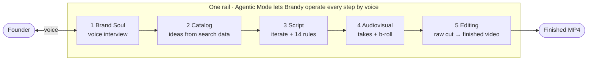

# Architecture

How Brand Studio Agent is put together, and why each piece sits where it does. This document describes **what runs today**. Per-piece history is in the [CHANGELOG](../CHANGELOG.md); the build specs and their test evidence are in [docs/specs/](specs/README.md).

---

## The shape of the problem

Two things happen on very different timescales:

- **The conversation** is real time. Sub-second. If it stalls, the product feels broken.
- **The work** — research, script judging, asset generation, rendering — takes seconds to minutes.

A voice product that blocks while it works goes quiet, and silence in a conversation reads as failure. So the architecture keeps the two apart: the voice layer answers immediately, and anything slow becomes a **background job** with a visible status.

---

## Where each thing runs

| Piece | Runs on | Why there |
|---|---|---|
| Web app, API and static frontend (`app/`) | **Render.com** (auto-deploy from `main`) | Light Python service; the browser talks to it over HTTPS |
| Voice conversation | **AssemblyAI Voice Agent API** (WebSocket from the browser) | One connection handles speech-to-text, the model, speech and interruption |
| Data, auth, files | **Supabase** (Postgres with row-level security, Auth, private Storage) | Sessions, brain, catalog, scripts, jobs, credits, audit trail |
| Images, video, text models | **Google Vertex AI** (Gemini, Veo) and Gemini with search grounding | Generation that AssemblyAI does not cover |
| Final video render (`render_service/`) | **Google Cloud Run** (separate container, scales to zero) | FFmpeg and headless Chromium need CPU and RAM that a free web tier does not have |

`render_service/` lives in this repository with its own `Dockerfile` and `requirements.txt`. It is an independent FastAPI service; `app/` reaches it over HTTP with a shared secret.

---

## The rail: five steps

Each step unlocks the next; a step you have not finished shows a lock and a way back.

| Step | What happens | Main code | Built on |
|---|---|---|---|
| 1. **Brand Soul** | Voice interview; the model calls `extract_brand_brain` and fills nine sections, each keeping the founder's quote. The Brand Soul document is generated from that brain and can be downloaded | `app/tools/brand_soul/`, `app/tools/brand_brain/`, `POST /api/brain/extract`, `POST /api/soul/generate` | AssemblyAI Voice Agent API, Gemini |
| 2. **Catalog** | Research pass collects demand signals; 30 ideas in 5 categories, each tied to a signal. The founder accepts, discards, regenerates or adds ideas, then locks | `app/catalog/`, `POST /api/catalog/generate`, `/investigate`, `/lock` | YouTube Data API, Gemini search grounding |
| 3. **Script** | A 6-phase script per idea, iterated scene by scene. Fourteen deterministic rules audit it (no LLM); the nine critical ones must pass before it can be locked | `app/scripting/`, `POST /api/script/generate`, `/scene/{n}/regenerate`, `/lock` | Rules engine, Gemini for rewriting |
| 4. **Audiovisual** | Teleprompter takes are recorded and transcribed with word-level timestamps; b-roll per scene is chosen by the founder (camera, stock, motion graphic, AI image, AI video) with the price shown first | `app/audiovisual/`, `POST /api/audiovisual/{idea}/generate`, `/takes/{n}/commit`, `/jobs` | AssemblyAI transcription, Pexels/Pixabay, Vertex AI |
| 5. **Editing** | Raw cut, then auto-edit (silence trimming, captions, overlays, looks), then export | `app/editing/`, `POST /api/editing/{idea}/raw`, `/dress`, `/render`; `render_service/` | FFmpeg, headless Chromium |

---

## The voice layer

- **Token minting.** The AssemblyAI key never reaches the browser. `GET /api/token` (and `/api/agent-token`, which delegates to it) mints a short-lived token; the browser passes it on the WebSocket URL. If the upstream call fails, the charge is refunded.
- **Voice billing.** Voice is charged in advance in one-minute blocks of 7.5 credits (`POST /api/voice/reserve`). If the tab closes, billing simply stops renewing, so there is nothing to clean up.
- **Audio.** PCM16 mono at 24 kHz, base64, from an `AudioWorklet` (`app/static/audio-processor.js`). Playback is flushed on the speech-started event, which is what makes barge-in feel instant.
- **Tools.** The voice model can call tools scoped to the current step (`script_iterate_scene`, `av_regenerate_asset`, `edit_render`, `catalog_research_demand`, `extract_brand_brain` and others, defined in `app/static/agent.js`). Each one calls the **same frontend functions and backend endpoints as the buttons**; there is no parallel backend.

### Agentic Mode: confirm, then act

1. The founder asks for something by voice.
2. The model calls `propose_action`. Each action in the registry (`app/static/actions.js`) declares its step, its credit `cost()` and whether it `needsConfirm`.
3. For actions that need confirmation, Brandy states what will happen and its price, then waits.
4. `app/static/confirm_engine.js` decides whether the next utterance is an explicit confirmation (`confirm`, `yes do it`, `do it`, `go ahead`, `proceed`). A bare "yes" is rejected, and a pending confirmation expires after **45 seconds**. The **code** checks the phrase, not the model.
5. Only then does `confirm_action` run the action. Every call carries `X-Agent-Action-Id` and is logged.

The audit trail is the `agent_actions` table (`supabase/migrations/014_agent_actions.sql`, row-level security on, service-role access only), written by `app/agent/store.py` and exposed at `/api/agent/actions`. The production panel (`app/static/production_panel.js`) renders it as a live card queue with status, step, credit cost and a link to the asset. Jobs that finish later settle their card through `settle_actions_for_job`.

---

## The work: background jobs and money safety

Anything slow — asset generation, the render — runs as a **resumable background job** (`app/audiovisual/jobs.py`, `worker.py`; `supabase/migrations/011_add_asset_jobs.sql`). The request returns immediately with a job id, the UI shows a progress bar, and the voice agent announces when a job finishes.

Real AI calls cost real money, so the design fails closed:

- **Charged only on success.** A write-ahead flag is set before the paid call, so a retry or a restart can never charge twice.
- **Refunds on upstream failure** for the voice token, demand research and Brand Soul regeneration.
- **Monthly AI spend brake** (`AV_MONTHLY_AI_SPEND_CAP_USD`, default $20) checked in the estimate, when generating, when regenerating, when switching a scene to AI and, last, in the worker right before the paid call. If the check itself fails, AI is treated as paused (`app/audiovisual/spend_guard.py`).
- **Per-video ceiling** ($1.50 real cost) and **at most one AI video per script**.
- **Price is shown first** in the estimate and on the button, in credits.

---

## Editing: one plan, two renderers

The editor produces a single **RenderIR** (`app/editing/ir.py`), a JSON plan of scenes, captions, overlays, looks and audio. Two things read it and draw the same numbers:

- the **browser preview** (`app/static/editing_preview.js`), so the founder sees what they will get;
- the **render service** (`POST /v1/render` in `render_service/app.py`), which builds the raw cut (`ffmpeg_raw.py`), captures motion-graphic HTML scenes at 30 fps with headless Chromium (`seek_capture.py`, `motion.py`) and burns in subtitles and overlays (`ffmpeg_dress.py`).

`render_service/version.py` holds an **engine version**. Any change that affects how a frame is drawn bumps it, so a re-render after a fix produces a new MP4 instead of reusing a cached one. Pricing follows that rule: the first render of an idea costs more, later renders less, and a re-render caused only by an engine change is free.

An **empty-scene guard** replaces a motion graphic that rendered blank with the founder's face take or a declared AI image, and the response lists the fallback so the UI can warn.

---

## Data

Postgres on Supabase, with row-level security. Migrations are in `supabase/migrations/` (001–014; 008 and 009 were never used). Highlights: user auth and RLS (001), Stripe customer and webhook events (002–003), atomic credit accrual (004), catalogs (007), scripts (010), asset jobs (011), editing (012), credit locking (013) and the agent audit trail (014). The full schema is in `supabase/schema.sql`.

---

## Testing

`python -m pytest -q -m "not e2e"` runs the whole suite. A network lock blocks every outbound connection during tests and the test config never loads a real `.env`, so no test can spend money or reach a paid API. Frontend logic that is shared with the browser (for example `confirm_engine.js`) is also exercised from Node.
